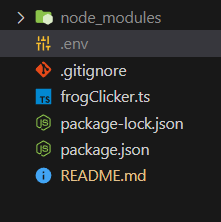

# 🐸 Frog Hunter - The Ultimate Frog-Crypto Autoclicker

Welcome to the mystical swamps of automation, where your trusty Frog Hunter bot awaits to leap into action! This little froggy friend tirelessly searches for opportunities, clicking buttons on the mystical [Zupass](https://zupass.org/#/login) marshlands whenever they emerge from the mists.

## 🌟 Features

- Automated button clicking for the most eager frog hunters.
- Environmentally friendly - runs in your local pond (local machine).
- Magically identifies buttons ready for a click.
- Never tires, unlike its human companions.
- Uses ancient `.env` scrolls to keep your secrets safe.

## 📜 Ancient Scroll Setup (Installation)

Before you embark on your frog-hunting adventure, you must prepare your tools.

## Prerequisites

Before we embark on this adventure, you'll need to have Node.js installed in your environment. If you haven't already, jump over to the [Node.js website](https://nodejs.org/) and download the latest version for your operating system.

## Setup

Once you've got Node.js installed, it's time to set up the autoclicker. Here's how:

1. Clone this repository using your terminal:
   ```sh
   git clone https://github.com/Crath-Bandicoot/frog-crypto-autoclicker.git
   ```
2. Open Cloned Repo:
   ```sh
   cd frog-crypto-autoclicker
   ```
3. Install Required Dependencies:
   ```sh
   npm install
   ```
4. Install Playwright Dependencies:
   ```sh
   npx playwright install
   ```

## 🗝️ Securing the Magic Words (Environment Variables)

Replace your-email@example.com and your-magical-password with your Zupass login credentials. Fear not, this scroll is enchanted to be invisible to prying eyes.

1. Create a .env file

   

2. Added Frog Credentials here:
   ```sh
   USER_EMAIL=your-email@example.com
   USER_PASSWORD=your-magical-password
   ```
3. After SAVING, to run the app simply run this command
   ```sh
   npm start
   ```
4. To close app either close browser or ctrl + c in terminal
